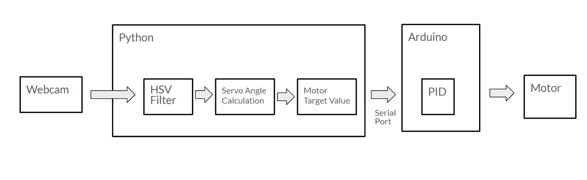

# RoboKeeper ⚽🤖
An autonomous tabletop robotic goalkeeper using computer vision and feedback control.

---

## Problem Statement

Design and implement an autonomous robotic goalkeeper that:

- Detects a moving ball using computer vision,  
- operates in real time under constraints, and sensor noise
- Uses feedback control (PID) to actuate a motorized platform to intercept the ball before it reaches the goal.
  
---

## Hardware Setup

  

  <em>Figure 1: Tabletop RoboKeeper hardware setup showing the camera, actuator, and goal region.</em>

## System Architecture 

  

  <em>Figure 2: Software and hardware pipeline for real-time ball tracking and motor control.</em>

The system is split between a high-level perception and planning pipeline running in Python and a low-level control loop implemented on an Arduino microcontroller.

The webcam streams frames to the Python process, where HSV color filtering is used to detect the ball. From the detected ball position, a target servo angle is computed corresponding to the predicted interception point at the goal plane. This target value is transmitted to the Arduino over a serial connection.

On the microcontroller, a PID controller regulates the motor position to track the commanded target angle, enabling fast and stable interception of incoming shots.

## Requirements

### Software
- Python 3.x  
- OpenCV (`cv2`)  
- NumPy  
- Matplotlib  
- Arduino IDE  

### Hardware
- USB camera (~100 FPS recommended)  
- DC motor  
- Motor driver  
- Arduino Uno  
- Jumper wires  
- Ping pong ball (target object)  
- Tabletop field and goal frame / net  
- 3D-printed goalie  
- 3D-printed motor mount (for securing the motor)  
- Rectifier (for motor driver power conditioning)

## Demo

  

  <em>RoboKeeper intercepting incoming shots in real time.</em>

---

## Full Videos & Project Report

### Project Video
- Full experimental demonstration (Google Drive):  
  [https://drive.google.com/drive/u/1/folders/1uzplka4dZxbBwikLdM6qgB1QsYYVn0e](https://drive.google.com/drive/u/1/folders/1Uzplka4dZxbBwiIkLdM6qgbIQSyYVn0e)

### Project Report & Slides
- **Project Report:**  
  [[https://docs.google.com/document/d/1MkC1aidd55K4iyMSY5kiwpvNu3FIF6F0h_RNyExWs/edit?usp=sharing](https://docs.google.com/document/d/1MKcIadid55K4IyM5MY5kiwpVNu3FFlF6F0h_RNyExWs/edit?usp=sharing)](https://docs.google.com/document/d/13RaCCt7X9L0syoJMb5IiYj2unm0OBDHEJllr3QrTJZc/edit?usp=sharing)

- **Slides:**  
  [https://docs.google.com/presentation/d/1fh9ue1M_8_9XWQy9-JK1InU17LAvPNkAuEvablz29g/edit?usp=sharing](https://docs.google.com/presentation/d/1fh9ueJlM_8_9XWqYq-JKLTnL1ZlAvPNkAuEvablz90g/edit?usp=sharing)

